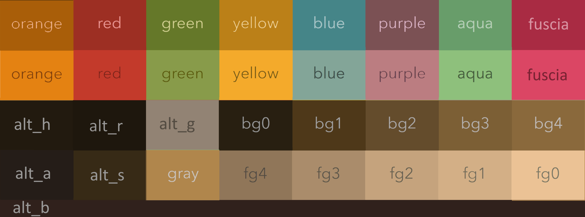
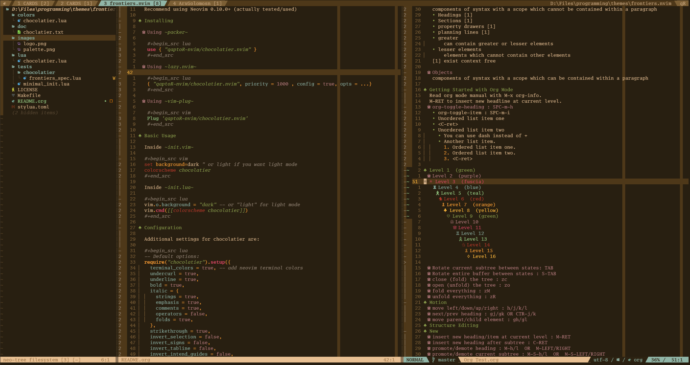

#+html:

#+html:
#+html:<h1>Chocolatier.nvim</h1>
#+html:

#+begin_comment

 
  #insert social media badges here
  

#+end_comment

An espresso/kimbie inspired chocolatey theme written in lua with treesitter and semantic highlights support!

Adapted from ~ellisonleao/gruvbox.nvim~ theme.

#+html:

#+html:

#+begin_quote
Light and Dark modes are available now. Light mode is currently a straightforward inversion of dark mode colors.

Only =alt_g= is in use for now, the rest will be implemented over time where applicable.

All colors are subject to slight variation as this theme is still in development.
#+end_quote

| color         | hex    | rgb                | Notes                         |
|---------------+--------+--------------------+-------------------------------|
| orange        | a95e09 | rgb(169, 94, 9)    | updated to intensify          |
| bright_orange | e48212 | rgb(228, 130, 18)  | and differentiate from yellow |
|---------------+--------+--------------------+-------------------------------|
| red           | 9d2f23 | rgb(157, 47, 35)   |                               |
| bright_red    | c33a2b | rgb(195, 58, 43)   |                               |
|---------------+--------+--------------------+-------------------------------|
| green         | 657829 | rgb(101, 120, 41)  |                               |
| bright_green  | 889b4a | rgb(136, 155, 74)  |                               |
|---------------+--------+--------------------+-------------------------------|
| yellow        | bb8018 | rgb(187, 128, 24)  | updated to intensify          |
| bright_yellow | f4aa2b | rgb(244, 170, 43)  | and differentiate from orange |
|---------------+--------+--------------------+-------------------------------|
| blue          | 458588 | rgb(69, 133, 136)  |                               |
| bright_blue   | 83a598 | rgb(131, 165, 152) |                               |
|---------------+--------+--------------------+-------------------------------|
| purple        | 7b5154 | rgb(123, 81, 84)   |                               |
| bright_purple | bb7d81 | rgb(187, 125, 129) |                               |
|---------------+--------+--------------------+-------------------------------|
| teal          | 689d6a | rgb(104, 157, 106) |                               |
| bright_teal   | 8ec07c | rgb(142, 192, 124) |                               |
|---------------+--------+--------------------+-------------------------------|
| fuscia        | a92b43 | rgb(169, 43, 67)   |                               |
| bright_fuscia | db4664 | rgb(219, 70, 100)  |                               |
|---------------+--------+--------------------+-------------------------------|
| alt_h         | 221a0f | rgb(34, 26, 15)    |                               |
| alt_g         | 928374 | rgb(146, 131, 116) |                               |
| alt_r         | 1e170d | rgb(30, 23, 13)    |                               |
| alt_s         | 372a16 | rgb(55, 42, 22)    |                               |
| alt_a         | 251d18 | rgb(37, 29, 24)    |                               |
| alt_b         | 30211c | rgb(48, 33, 28)    |                               |
|---------------+--------+--------------------+-------------------------------|
| bg0           | 281f11 | rgb(40, 31, 17)    |                               |
| bg1           | 4e3819 | rgb(78, 56, 25)    |                               |
| bg2           | 644c2c | rgb(100, 76, 44)   |                               |
| bg3           | 7c5f35 | rgb(124, 95, 53)   |                               |
| bg4           | 8a693c | rgb(138, 105, 60)  |                               |
|---------------+--------+--------------------+-------------------------------|
| fg0           | ebc295 | rgb(235, 194, 149) |                               |
| fg1           | d3af86 | rgb(211, 175, 134) |                               |
| fg2           | c5a37d | rgb(197, 163, 125) |                               |
| fg3           | aa8c6b | rgb(170, 140, 107) |                               |
| fg4           | 907659 | rgb(144, 118, 89)  |                               |
|---------------+--------+--------------------+-------------------------------|
| gray          | b0864c | rgb(176, 134, 76)  |                               |
|---------------+--------+--------------------+-------------------------------|

* Prerequisites

Neovim 0.8.0+ (according to original gruvbox.nvim)

Recommend using Neovim 0.10.0+ (actually tested/used)

* Installing

** Using ~packer~

#+begin_src lua
use { "qaptoR-nvim/chocolatier.nvim" }
#+end_src

** Using ~lazy.nvim~

#+begin_src lua
{ "qaptoR-nvim/chocolatier.nvim", priority = 1000 , config = true, opts = ...}
#+end_src

** Using ~vim-plug~

#+begin_src vim
Plug 'qaptoR-nvim/chocolatier.nvim'
#+end_src

* Basic Usage

Inside ~init.vim~

#+begin_src vim
set background=dark " or light if you want light mode
colorscheme chocolatier
#+end_src

Inside ~init.lua~

#+begin_src lua
vim.o.background = "dark" -- or "light" for light mode
vim.cmd([[colorscheme chocolatier]])
#+end_src

* Configuration

Additional settings for chocolatier are:

#+begin_src lua
-- Default options:
require("chocolatier").setup({
  terminal_colors = true, -- add neovim terminal colors
  undercurl = true,
  underline = true,
  bold = true,
  italic = {
    strings = true,
    emphasis = true,
    comments = true,
    operators = false,
    folds = true,
  },
  strikethrough = true,
  invert_selection = false,
  invert_signs = false,
  invert_tabline = false,
  invert_intend_guides = false,
  inverse = true, -- invert background for search, diffs, statuslines and errors
  contrast = "", -- can be "hard", "soft" or empty string
  palette_overrides = {},
  overrides = {},
  dim_inactive = false,
  transparent_mode = false,
})
vim.cmd("colorscheme chocolatier")
#+end_src

*VERY IMPORTANT*: Make sure to call setup() *BEFORE* calling the colorscheme command,
to use your custom configs

** Overriding

*** Palette

You can specify your own palette colors. For example:

#+begin_src lua
require("chocolatier").setup({
    palette_overrides = {
        bright_green = "#990000",
    }
})
vim.cmd("colorscheme chocolatier")
#+end_src

*** Highlight groups

If you don't enjoy the current color for a specific highlight group,
now you can just override it in the setup. For example:

#+begin_src lua
require("chocolatier").setup({
    overrides = {
        SignColumn = {bg = "#ff9900"}
    }
})
vim.cmd("colorscheme chocolatier")
#+end_src

It also works with treesitter groups and lsp semantic highlight tokens

#+begin_src lua
require("chocolatier").setup({
    overrides = {
        ["@lsp.type.method"] = { bg = "#ff9900" },
        ["@comment.lua"] = { bg = "#000000" },
    }
})
vim.cmd("colorscheme chocolatier")
#+end_src

Please note that the override values must follow the attributes from the
highlight group map, such as:

- *fg*     - foreground color
- *bg*     - background color
- *bold*   - true or false for bold font
- *italic* - true or false for italic font

Other values can be seen in
[[https://neovim.io/doc/user/builtin.html#synIDattr()][~synIDattr~]]
